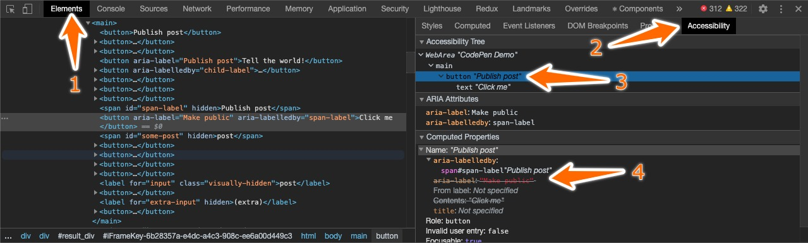
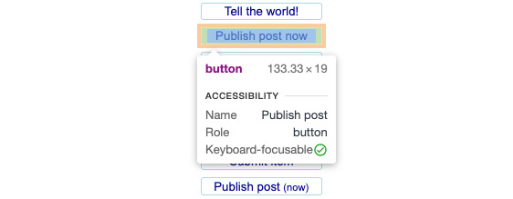

When you see a button on a webpage, you probably know what it does. If you don't, the page is poorly made. But just because _you_ do, when you _see_ it, doesn't mean a non-visual user does when interacting with it.

Maybe the button has a text label – okay then a screen reader can easily read the name of the button. But the button text might only make sense it the context of the element it is next to – e.g. it might say `"Select this"` where _"this"_ makes perfect sense when viewed, but not when read aloud.

The button might in stead have an image, an SVG-shape or even some weird font glyph as its visual element - something that'll make sense to you as a sighted user, but not to a user with a screen reader this isn't informed of what the image represents.

And all of the above applies not only to buttons, but also to input fields, headlines, images, videos and many other important smaller elements of your web application.

In all such cases, you should make sure to provide a textual, meaningful **accessible name** to the element in question.

## What is the accessible name?

The accessible name is the text string used by browsers and screen readers to represent the element in question. The algorithm for resolving the accessible name of an element is quite complex to account for some rather esoteric situations. However in practice most of the algorithm steps can be ignored and the accessible name is trivial to glean from any element.

The actual algorithm is described in the [Accessible Name and Description Computation 1.1 W3 specification](https://www.w3.org/TR/accname-1.1) in [section §4.3](https://www.w3.org/TR/accname-1.1/#mapping_additional_nd_te). However, this reads fairly badly and it's much better understood through some (more or less common) examples.

## Examples of accessible names in HTML

Here's a bunch of buttons, that on the surface appear to be very different, but all have the **exact same accessible name**, namely the string `"Publish post"`.

These examples will give you an idea as to how different elements can be labelled in different ways - including images, texts, SVG's and input elements:

```html
<!-- Just a button with text content -->
<button>
  Publish post
</button>

<!-- Nested tags inside -->
<button>
  Publish 
  <span><em>p<strong>o</strong></em>st</span>
</button>

<!-- Some content hidden - but only for accessibility -->
<button>
  Publish 
  <span aria-hidden="true">new</span> 
  post
</button>

<!-- Label provided on parent element, ignoring content -->
<button aria-label="Publish post">
  Tell the world!
</button>

<!-- Label provided by child node -->
<button aria-labelledby="child-label">
  <span id="child-label">Publish post</span>
   now
</button>

<!-- A button with both a direct label and another element as label
where the latter takes precedence
Note that this even works with a hidden (or aria-hidden) label element -->
<span id="span-label" hidden>
  Publish post
</span>
<button aria-label="Make public" aria-labelledby="span-label">
  Click me
</button>

<!-- Image with alt text -->
<button>
  Publish
  
</button>

<!-- Emojis can be made accessible too - but remember the role="img" -->
<button>
  Publish 
  <span aria-label="post" class="emoji" role="img">✉️</span>
</button>

<!-- Image with empty alt is ignored -->
<button>
  
  Publish post
</button>

<!-- A combination of two child elements labelled in different ways -->
<span id="some-post" hidden>
  post
</span>
<button>
  <span aria-label="Publish">
    Submit
  </span> 
  <span aria-labelledby="some-post">
    item
  </span>
</button>

<!-- SVG text is ignored -->
<button>
  Publish post 
  <svg viewbox="0 0 20 10">
    <text x="2" y="8" fill="currentColor" >(now)</text>
  </svg>
</button>

<!-- SVG title is respected though -->
<button>
  Publish 
  <svg viewbox="0 0 10 10">
    <title>post</title>
    <rect x="2" y="2" width="6" height="6" rx="1" fill="currentColor" />
  </svg>
</button>

<!-- But aria-label takes precedence over SVG title -->
<button>
  Publish
  <svg aria-label="post" viewbox="0 0 10 10">
    <title>item</title>
    <rect x="2" y="2" width="6" height="6" rx="1" fill="chocolate" />
  </svg>
</button>

<!-- Inputs can be referenced from a label -->
<label for="input" class="visually-hidden">
  post
</label>
<button>
  Publish
  <input id="input" type="text" disabled value="item" />
</button>

<!-- But a hidden label is ignored (unlike an element referenced via aria-labelledby) -->
<label for="extra-input" hidden>
  (extra)
</label>
<button>
  Publish post
  <input id="extra-input" type="text" disabled value="(extra)" />
</button>
```

That's quite the list - and it illustrates almost all the principles of the resolution of accessible names. Note however that most of them are pretty stupid.

You should never have an `<input>` inside a `<button>` - even if it is `disabled`. Nor should you have **one text** for sighted users and **a completely different text** for non-sighted users - that's only going to lead to confusion if they were ever to talk about their work.

## How to see the accessible name

But how do I actually know, that this text is in fact the accessible name for this element? Can I somehow test that it works correctly? Of course you can - right in your browser developer tools. In Chrome, you can find it right here:

<figure>
<a href="./chrome_dev_tools_accessible_name.jpg"></a>
<caption><em><small>Chrome developer tools showing the location of accessible name for an element - here showing in particular how `aria-labelledby` takes precedence over `aria-label`.</small></em></caption>
</figure>

And if you have upgraded to Chrome 84 or newer, it's even easier to see. Accessible name is now a first-class citizen in web debugging display directly in the web page when examining any HTML element along with the role and the keyboard focusability of the element:

<figure>
<a href="./chrome_dev_tools_display_accessible_name.jpg"></a>
<caption><em><small>Chrome developer tools displaying the accessible name directly in the page when inspected.</small></em></caption>
</figure>

## Examples of accessible names in action

Go ahead and try it out in [this Codepen of all the above buttons with the same accessible name](https://codepen.io/barklund/pen/mdVvPLv?editors=1100) right here:

{}

Inspect any of the `<button>`s here and see, that they all have the same accessible name: `"Publish post"`.

## Why accessible name is important for accessibility

Not all elements need an accessible name, but most do. 95% of the time, the accessible name is trivially just the text value of the component, but for those 5% (icon buttons, inputs, images, etc), it's good to know how to properly set it.

To reiterate: The accessible name of any element will determine how the element is announced to any vision-impaired user. Not properly setting the accessible name for even semi-complex components will confuse these users at best – and completely hinder them in using your application at worst.
