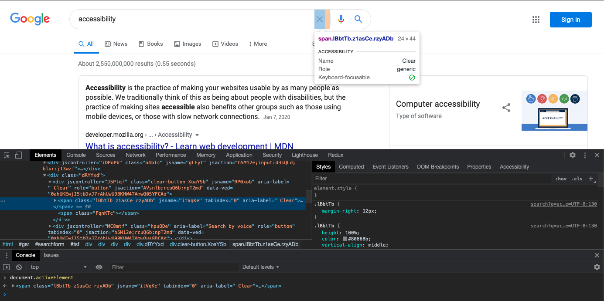
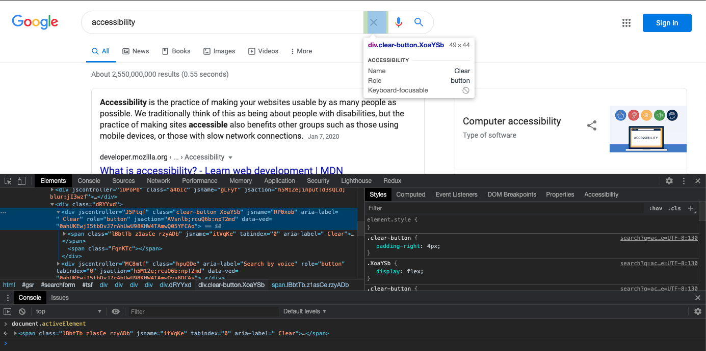
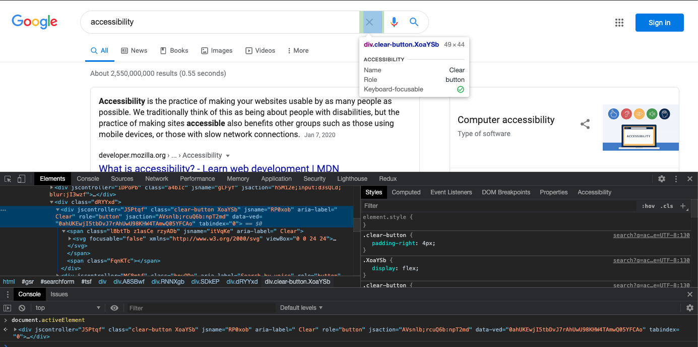
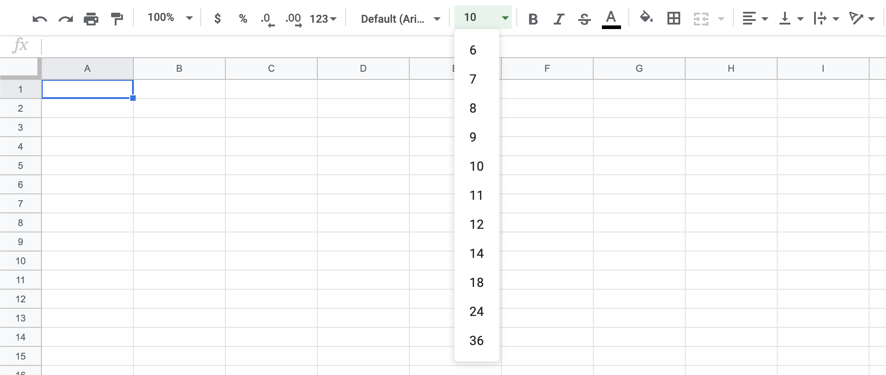
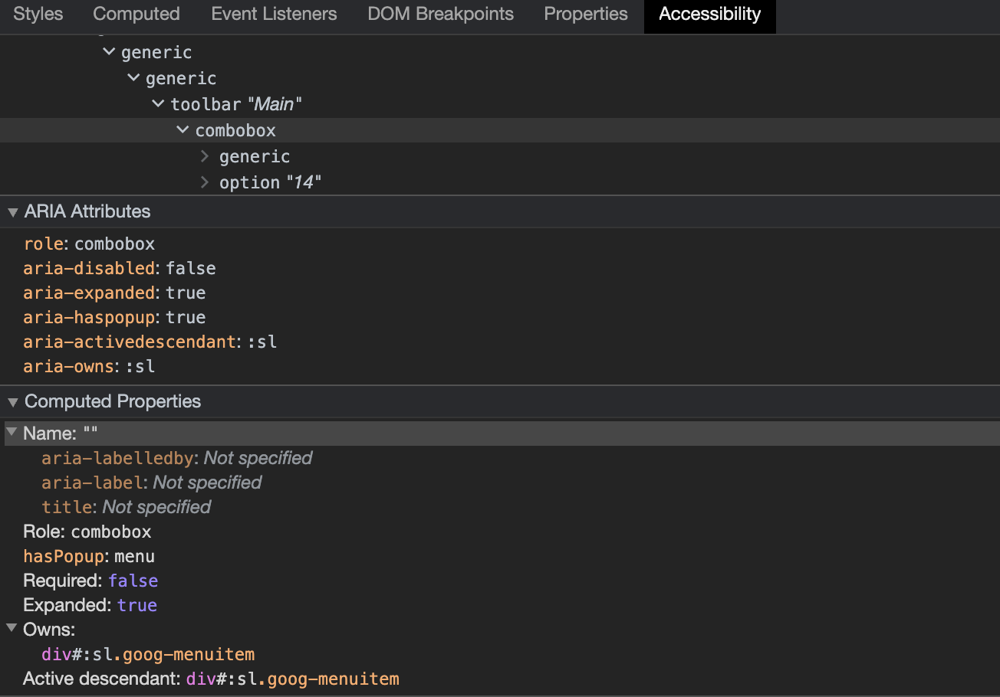
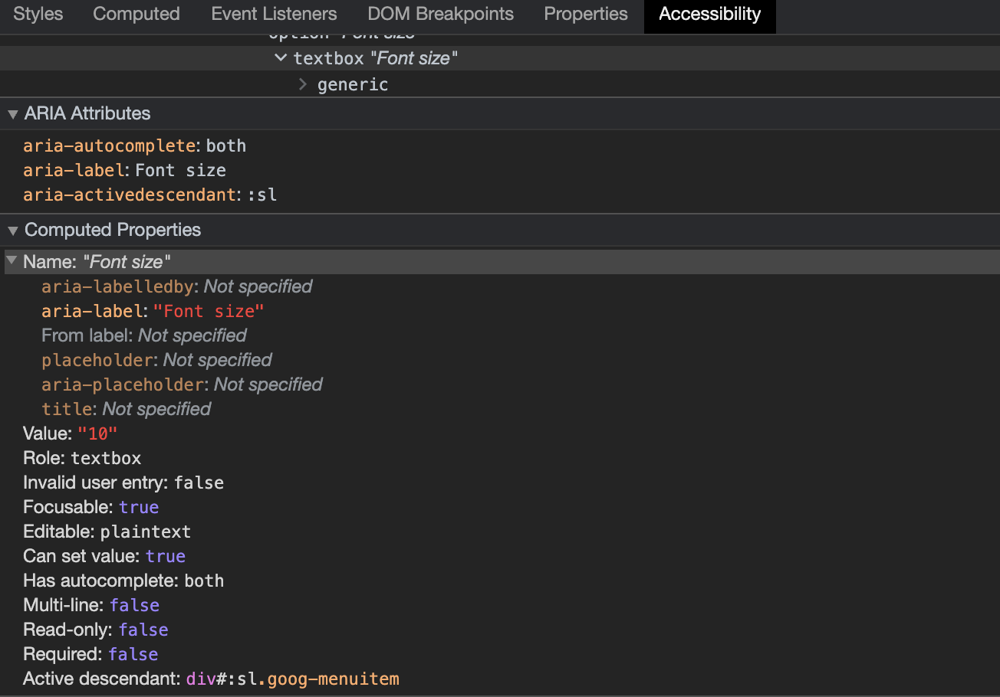
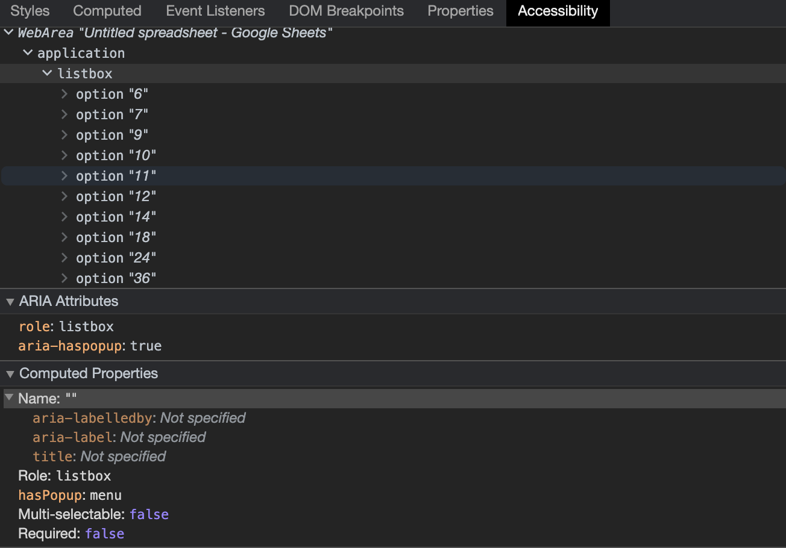

Google is not infallible. Even _they_ fail at following accessibility best-practices. I have found 3 examples of (very common) mistakes, that even the bright minds at Google and all their efforts and reviews failed to see before shipping them to end-users.

So did I have to dig deep to find an example? On the contrary – the very first example is right on the search/results page on Google Search! We're talking about probably the most viewed page on the entire web[[citation needed]](https://en.wikipedia.org/wiki/List_of_most_popular_websites) shown billions of times **every single day**! And it's a dumb error, easy to fix, but with actual consequences for real users.

Besides this error, I dug a bit deeper into some popular Google products and it wasn't hard to find a couple of accessibility mistakes in both Gmail and Google Docs/Google Sheets.

That Google isn't infallible is of course the understatement of the year, but Google is by many developers and end-users seen as the pinnacle of software and developer excellence. Google has incredibly high standards for employees and projects and is surrounded by a mystical aura of basically being the best at everything they set their minds to.

However, this article is not about Google's perceived (lack of) perfection. This is about accessibility. And it's about trying, failing, and trying again. Because Google does try - they try really hard! They have [an internal division](https://twitter.com/googleaccess) dedicated only to accessibility, have a process for internal accessibility reviews applied to all their products, and they provide [guidelines for the rest of us](https://www.google.com/accessibility/) on how to make our sites more accessible. And yet, sometimes even they fail as demonstrated below.

But fear not, all the below examples can be fixed and even Google can get better at this. Fear of failing is no excuse for not trying however - you have to do your very best and keep going at it.

> Accessibility is not a sprint. It's not even a marathon. It's staying healthy your entire life by staying active continuously always trying to do better.

**NB**: Note that all of these examples are valid as of August 16, 2020. This will most likely chance in the future. If it does seem outdated, please [ping me on twitter](https://twitter.com/barklund).

---

## 1. "Clear input" in Google Search

The first example of an accessibility _faux pas_ comes right at the core of Google's products - Google Search itself. And not even hidden away somewhere obscure, but right there in the search input field on every search and results page.

### Steps to reproduce

1. Go to [google.com](https://google.com)
2. Type something in the search field, e.g. _"accessibility"_
3. Press the tab key and observe, that the _"clear"_ button (stylized as an _"×"_) has focus
4. Press the space bar to activate the button
5. Observe that nothing happens

The expected result is, that the search input is cleared when the space bar is pressed.

### What's wrong?

It happens to be a quite simple mistake, but it took me a few minutes to figure out what went wrong here. Because you can press the enter key to activate the button, just not the space bar.

When you have pressed the tab key to focus the _"clear"_ button, try to open the developer console and inspect the active element (the element with current focus) by typing `document.activeElement`. As you can see in the following screenshot, the active element is a ``. And it is focusable, but it has no semantic role (shown as `generic`):

<figure>

<caption><em><small>This shows the active element after tabbing from the search input field - it's clearly a generic <code>&lt;span /></code> in focus, not a button.</small></em></caption>
</figure>

But the parent node is a button – as you can see here:

<figure>

<caption><em><small>The parent of the previous generic element is the actual button - but it's not focusable?</small></em></caption>
</figure>

This button is not focusable though, but it has the proper role. Both elements have a proper [accessible name]() (but the accessible name has no real purpose for an element without a semantic role).

### How can this be fixed?

It makes no sense, that the span inside the button is focusable and the button isn't. If we simply move the `tabindex="0"` attribute from the span to the button, we now get the following situation after pressing the tab key from the input:

<figure>

<caption><em><small>In the HTML <code>tabindex="0"</code> has been moved from the generic child element to the button and now everything works correctly (except for missing focus styling)</small></em></caption>
</figure>

The button correctly has focus and it can now be activated using the space bar in addition to the enter key. In the process, we did unfortunately lose visual focus styling, but that can easily be remedied.

### Impact

#### How bad of a violation is this?
This is actually a big deal. Buttons, or things that act like buttons, should in fact **be** buttons. That the generic child element can receive focus rather than the button is a grave violation of guidelines and in fact expectations and this breaks the ability of assistive technologies to correctly aid users in using the product. One direct consequence of this is the lack of support of activating the (non-)button using the space bar.

#### What is the impact on users?
Probably not too grave - most keyboard-only users will probably already be using the enter key to click buttons, and if not they'll probably try the enter key after discovering, that the space bar doesn't do anything. The (non-)button is also announced wrongly when focused, but that's probably a fairly minor issue in this instance.

---

## 2. "Hangout tablist" in Gmail

Gmail has a little tablist in the lower-left corner (if you use the desktop experience at least), that allows you to see your contacts, your most recent hangouts or most recent phone calls. You can select which tab is active from a little icon-based tab list at the bottom of the widget. There is however a number of problems with this tab list - not just deviations from specifications, but even worse some confusing and directly dysfunctional interaction patterns.

### Steps to reproduce

This is an illustration of one of the more serious issues with this tab list:

1. Click the _"phone call"_ icon (📞) and observe the panel switch to recent phone calls
<figure>

<caption><em><small>This shows the "phone calls" tab open.</small></em></caption>
</figure>

2. Press the tab key a few times until focus is on the currently active tab
<figure>

<caption><em><small>This shows the "phone calls" tab open and with keyboard focus.</small></em></caption>
</figure>

3. Press enter and observe the tab closing (leaving no tab open)
<figure>

<caption><em><small>This shows the "phone calls" tab closed and with keyboard focus.</small></em></caption>
</figure>

4. Press enter again and observe the tab opening again
5. Now press the left arrow key twice and observe, that some alternate focus appears to shift to the _"contacts"_ tab as its icon lights up in a brighter white than the others and with a noticable difference in background color
<figure>

<caption><em><small>This shows two different kinds of focus on different tabs.</small></em></caption>
</figure>

6. Press enter to activate the _"contacts"_ tab
7. Observe that instead of activating the _"contacts"_ tab, the _"calls"_ tab simply closes as if it was the one having focus (which it is in some sense)
<figure>

<caption><em><small>After attempting to activate the "contacts" tab, the "phone calls" tab simply closes.</small></em></caption>
</figure>

The expected behavior is of course, that the focussed tab changes when arrow keys are pressed - both visually but also with respect to being the actual `document.activeElement`.

### What's wrong?

There's several problems with the tab list implementation here.

The biggest problems are:

1. A tab list should only have the current tab as part of the tabbing order - you should not be able to use the tab key to move between the different tabs (this is known as [_"roving tabindex"_](https://www.w3.org/TR/wai-aria-practices/#kbd_roving_tabindex)[^1]).
1. When focussing another tab using arrow keys, keyboard focus should follow. This implementation with two different sets of focus makes no sense at all.
1. The tab panels aren't actually marked up as such (with `role="tabpanel"`) and are missing all the relevant `aria-*` attributes expected of such an element.

[^1]: <em>"roving tabindex"</em> is not the only option here, the concept of [_"active descendant"_ is a valid alternative](https://www.w3.org/TR/wai-aria-practices/#kbd_focus_activedescendant). However if that's the path chosen, then none of the tabs should have `tabindex="0"`, only the tablist itself should be in the tab order. This implementation somehow falls between both options while also conforming to neither.

Smaller problems include:

1. The tab list itself can receive tab focus, but doesn't have an accessible name, so the user has no idea what actually has focus nor what to do with it. According to the specification, the tab list _can_ have focus but doesn't need to in this case.
1. The tabs section of WAI-ARIA does not describe the interaction of closing the currently active tab panel. Re-activating the active tab should just do nothing. However, given that the specification also allows for multiple tabs to be open at the same time, zero tabs open could be considered a legal configuration – albeit unusual.
1. The `aria-controls` property is missing from all the tab buttons - thus leaving assistive technologies without information about what the tab actually controls.
1. Tabs should auto-select when receiving focus in such a simple tab panel setup as this one. The [recommendation in WAI-ARIA](https://www.w3.org/TR/wai-aria-practices/#issue-container-generatedID-25) is that tabs auto-select when receiving focus (_"selection follows focus"_) unless expensive calculation or external load is involved. In this instance, the information is already available and there's no reason not to switch tabs as soon as a tab receives focus (by pressing arrow keys, **not** the tab key). This could be excused in this instance though, as the tab panels actually live inside another iframe, but the content for all of them is preloaded anyway.
1. `aria-activedescendant` is used to highlight which tab has "visual focus" (the focus that can be navigated using arrow keys), however that is not necessary according to specification. It's superfluous information - the focussed tab can be deduced from it having `tabindex="0"` and the active tab(s) from having `aria-selected="true"` (which is recommended above to be the same thing).

### How can this be fixed?

This does not come with an easy fix. I suspect a major overhaul of the widget is required to make it behave according to specifications. These would be the steps I'd go through to fix it:

1. Move the tab list and tab panels to live in the same document. If the tab panels have to exist in an external iframe, I'd move the tab list there as well - it makes for a much cleaner and more logical DOM Structure.
1. Correctly set roles and `aria-*` attributes on all involved elements.
1. Make sure `tabindex` is updated on the tabs, so only the currently open tab has `tabindex="0"`, the others should have `-1` - do this when tabs received focus both from mouse and keyboard.
1. Remove the weird functionality of closing the active tab. It serves no purpose.
1. When navigating with the arrow keys between the tabs, make sure that the tab actually receives keyboard focus and not just visual focus by calling `.focus()` on it.
1. Finally, I'd probably also implement that _"selection follows focus"_, as previously mentioned, as it is the most common implementation for a simple tab interface such as this one.

Correctly implementing tabs is not hard and has been done many times. If nothing else, one can start with [the very nice example](https://www.w3.org/TR/wai-aria-practices/examples/tabs/tabs-1/tabs.html) created by W3.

I have done this myself – on a Google project even. The [Google Web Story Editor](http://goo.gle/storyeditor) has tabs in a few locations implemented with full adherence to the recommendations ([implementation in React](https://github.com/google/web-stories-wp/blob/main/assets/src/edit-story/components/tabview/index.js)).

### Impact

#### How bad of a violation is this?

This is in many ways directly against recommendations. I hope that this is "just" a partial implementation of the WAI-ARIA tab recommendation (which is about as good as not implementing it at all), and but I fear that it is something copy-pasted from another product and left rotting in the codebase.

The weirdest part of the implementation is definitely the dual-focus of using both `tabindex` and `aria-activedescendant` and allowing tabs to be "active" in 3 different ways. I can set up a situation where _one tab_ is open, _another tab_ has actual keyboard focus and _the last tab_ appears focussed (has bright white icon). That's completely misunderstood in so many ways.

#### What is the impact on users?

This is a pretty bad user experience for keyboard-only users. Tabs have an expected interaction model involving arrow keys to move between tabs and the tab key to move to and from the tab list - not this weird combination of both modes interspersing with one another.

I assume keyboard-only users can figure it out and stick with pressing only the tab key and not using the arrow keys, but it should not be a necessary workaround.

---

## 3. "Font size listbox" in Google Docs & Google Sheets

For this example we're now entering _small potatoes_ country. It's not that there aren't other accessibility misimplementations, it's just that this is an example of a very complex widget, that's almost perfect, but still lacking a bit.

This concens the font size dropdown available in both Google Docs and Google Sheets. It's a _combobox_ with an input (a _textbox_), that when focussed opens a _listbox_ with font size options:

<figure>

<caption><em><small>This shows an expanded font size combobox in Google Sheets.</small></em></caption>
</figure>

This pattern is [extremely well-described in WAI-ARIA](https://www.w3.org/TR/wai-aria-practices/#combobox), yet Google's implementation falls short on a few nit-picky details.

### Steps to reproduce

There's no actual user experience bug to reproduce here. The issue does not have user impact at all - unless screen readers and other assistive technologies aren't able to correctly help users achieve their goal.

### What's wrong?

This shows the ARIA information given about the three most important elements in this widget – the combobox, the listbox and the textbox:

<figure>

<caption><em><small>The <strong>combobox</strong> has quite a few properties and most of them are even correct!</small></em></caption>
</figure>

<figure>

<caption><em><small>The <strong>textbox</strong> has too few properties here.</small></em></caption>
</figure>

<figure>

<caption><em><small>The <strong>listbox</strong> has the weirdest property of all - you'll never guess which one!</small></em></caption>
</figure>

There's a few errors in the implementation, but overall it is very close to perfect.

The three most important problems are:

1. The _listbox_ element has `aria-haspopup="true"`. This makes no sense. The _listbox_ **is** a popup, it doesn't **have** a popup – and definitely not a _menu_ popup, which is [the default value for `true`](https://www.w3.org/TR/wai-aria-1.1/#desc-aria-haspopup:~:text=user%20agents%20MUST%20treat%20an%20aria%2Dhaspopup%20value%20of%20true%20as%20equivalent%20to%20a%20value%20of%20menu).
1. The _combobox_ doesn't have an accessible name. It [should have had an `aria-label`](https://www.w3.org/TR/wai-aria-practices/#wai-aria-roles-states-and-properties-6:~:text=the%20combobox%20element%20has%20a%20label%20provided%20by%20aria%2Dlabel).
1. The _combobox_ is listed as having the wrong type of popup. This is actually a weird error to make, because not using `aria-haspopup` would indicate that [the _combobox_ has a popup of type `listbox`](https://www.w3.org/TR/wai-aria-practices/#wai-aria-roles-states-and-properties-6:~:text=Note%20that%20elements%20with%20role%20combobox%20have%20an%20implicit%20aria%2Dhaspopup%20value%20of%20listbox.,-When) (which this one does), but actively setting `aria-haspopup="true"` indicates that the _combobox_ has a popup of type `menu`[^2].

[^2]: Google Chrome Developer Console is clearly not aware that the default value of `aria-haspopup` for a `role="combobox"` is in fact `listbox`. If you remove the property, `hasPopup` is simply not listed as one of the interpreted properties of the element, though it probably should have been.

Some minor errors include:

1. The _combobox_ has `aria-owns` set to the currently selected option. It should be set to [the _listbox_ as whole](https://www.w3.org/TR/wai-aria-practices/#wai-aria-roles-states-and-properties-6:~:text=combobox%20element%20contains%20or%20owns%20an%20element%20that%20has%20role%20listbox), not the individual option.
1. The _combobox_ has `aria-activedescendant` set, but this property only applies to elements with keyboard focus. Thus it should only [be set on the _textbox_](https://www.w3.org/TR/wai-aria-practices/#wai-aria-roles-states-and-properties-6:~:text=the%20textbox%20has%20aria%2Dactivedescendant%20set) (which it also is), not the _combobox_.
1. The _textbox_ does not have `aria-controls` set to the _listbox_, which [it should have](https://www.w3.org/TR/wai-aria-practices/#wai-aria-roles-states-and-properties-6:~:text=textbox%20element%20has%20aria%2Dcontrols%20set%20to%20a%20value%20that%20refers%20to%20the%20combobox%20popup%20element).

### How can this be fixed?

All the above errors come with instructions on how to fix them. They're all fairly straight-forward and should not take any skilled developer a long time to fix.

### Impact

#### How bad of a violation is this?
This is definitely a couple of tiny 🥔's (meaning _"unimportant deviations"_) and aren't urgent to fix. However, given that the guidelines are clear, it shouldn't have been an issue to implement it correctly the first time around.

One redeeming factor here could however be, that the recommendations have changed since the current implementation was made. That is not an unlikely scenario.

#### What is the impact on users?
None, as far as I can tell.

---

## In Summary

Trying is good. And while trying but failing is often better than not trying at all, for ARIA this is not always the case. The ARIA guidelines come with the notion, that [_"No ARIA is better than bad ARIA"_](https://www.w3.org/TR/wai-aria-practices/#no_aria_better_bad_aria), which seems harsh, but is in fact true. It's like having a blue underline text on your webpage, that isn't a link. If you mark something with ARIA attributes as having a certain behavior, which it then doesn't actually have, you're breaking that promise and failing your users.

> Falling back to the browsers default accessibility behavior is better than **mis**implementing your own.

This should however not discourage anyone from trying. Give it your best shot, but make sure to do your very best, test it out using real assistive technologies and keep working on it even after it seems complete, because standards and technology evolves - and your application should too!

