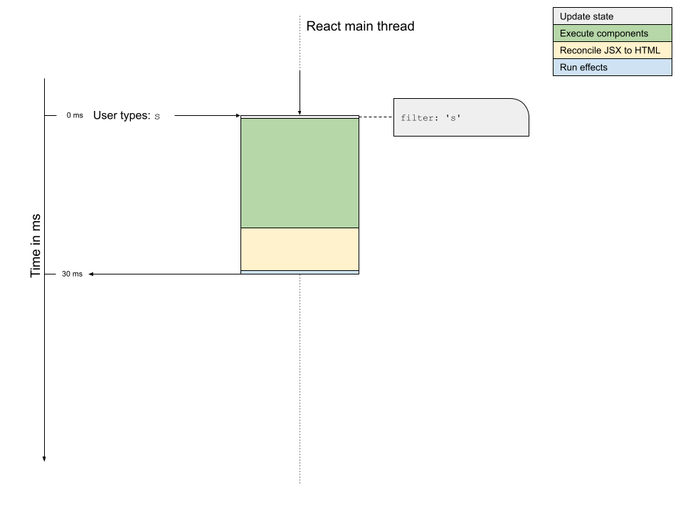

React 18 is out, and with it React introduced Concurrent Mode. Lots have been said about it, but I want to focus on one aspect of Concurrent Mode in particular: _Transitions_.

Despite the somewhat terrible name, React transitions are not related to CSS transitions nor about transitions between elements or visual states or anything like that. Let me have a go at a concise definition:

> React Transitions are (blocks of) state updates, that the developer instructs React to deprioritize and delay if something more important comes along.

The <em>transition</em> in this case is the state update instruction. If you instruct React to update some state somewhere in the application, but you instruct React to do it in a transition, it means that you allow React to do it as a low-priority, interruptable, and postponable action. React will eventually get to your transition, but it might be delayed behind any number of higher-priority updates for a while.

Transitions in React can be created in two ways using two new top-level functions in the React package: `startTransition` and its hook-variant, `useTransition`.

This is all pretty theoretical, so let's get practical.

---

Imagine that you're a big fan of Wordle, and you want to create a small helper tool to assist you in solving it. You're not looking for a big cheat engine, you can find plenty of those out there, just a small tool to look up all the possible words with some given letters.

We can easily create a simple React application, that achieves this. It's in fact right here [in this Codepen](https://codepen.io/barklund/pen/poaoezR?editors=0010) in just about 60 lines of code. Try typing some letters in the search field and see the list of words shrink with the typed letters highlighted:

{}

We're not going to go into detail about the business logic here. It could probably be better, but this works for our purposes. The app doesn't work great though, but it does work.

## Like, what's your problem, man?

So what is the problem with the above application? The list of allowed words in Wordle is pretty long. It's in fact 12,972 words long. That's a lot of HTML nodes to display in that list. And when you then have to re-render a ton of them with slight changes inside every single node – e.g. when highlighting all words containing just an "s" – things begin to be a bit choppy.

When React renders a component, it does a number of things, one after another. The most important parts are:

* Update the state of all components, that have been updated
* Run the actual render function (of each updated component) and collect the resulting JSX
* Reconcile that JSX into the existing HTML
* Run effects in the updates components

Especially the two middle steps can be quite time-consuming, depending on the complexity of the component functions and the updates made to the JSX.

We want our application to feel highly performant and responsive. When you enter a letter into the input, we want the input to immediately reflect that this letter was rendered. And due to the way React handles controlled inputs, we need React to re-render the component containing the input with an updated state. Because the list displayed below the input is taking a long time to render and the rendering of the list is tied to the rendering of the input (it all happens in the same component based on the same state value), our input seems unresponsive.

<figure>
<a href="./single_character.png"></a>
<caption><em><small>This illustrates what happens when you press a single character. React has to spend quite a lot of time first executing all the components, and then some more time reconciling the JSX into HTML.</small></em></caption>
</figure>

The problem really shows itself when you press two characters in quick succession. The full render cycle of the first character press is not completed before the second one happens. And then the full render cycle of the second character press is delayed:

<figure>
<a href="./multiple_characters.png"></a>
<caption><em><small>When you press multiple characters in quick succession in this naive app, the app hasn't updated after the first character press when the second occurs, so you have to wait even longer for the second one to complete.</small></em></caption>
</figure>

This is not a good strategy. We want the input field to render immediately, but we can live with the list rendering delayed if need be to make the app feel responsive. How can we do that?

## Low-priority updates with `startTransition`

Imagine that we could tell React to update something only when it has nothing more important to do. That is exactly what React transitions do, how very nice for this article!

The React API has been expanded with a new function in the main package, `startTransition`, which takes a callback as a parameter. If you wrap a state update in callback passed to `startTransition`, React will treat this (or these) state updates as lower-priority. React will run all the high-priority updates first and only run the lower-priority updates second, while also being able to abort those lower-priority updates as soon as something more important happens.

As we're going to take advantage of this new feature, what we want are these two things:

1. We want the value property on the input field to update instantly.
2. We want the filter property on the Words component to update only when it can do so without interrupting the user typing.

In the flow diagram, it will look something like this. Notice how the updates on the transition thread can be aborted if something more important happens. The low-priority update happening after pressing "s" is aborted in the figure below, because another high-priority update occurred. The low-priority update after pressing "st" is able to run to completion without being interrupted, and once completed, React allows the low-priority update to actually render into the main thread and be displayed to the user.

<figure>
<a href="./multiple_characters_with_transition.png"></a>
<caption><em><small>In this ideal world, we just update the value on the input at first when the user types to make the input field seem responsive, and only then we start calculating an update with the filter value applied to the Words component. We do that by making two separate state values, that we can update separately.</small></em></caption>
</figure>

**Note**: I have to be completely honest here and admit, that I don't know exactly how interruptable the transition update is. JavaScript is in its essence single-threaded so you cannot abort a function once run, but you can run code in another thread using web workers (background threads), so perhaps React can check some flag while running and abort if the flag is flipped from the "main" thread.

I imagine the component renders to all complete before React checks whether the resulting JSX should be reconciled to the DOM, but I am not completely sure. If you do know exactly how this works, feel more than free to [ping me on Twitter @barklund](//twitter.com/barklund).

Let's see how to do this in our component. The code we had before looked like this. Notice how we only have a single state variable, `filter`, that both updates the input field and the list displayed below:

<div class="dimmed">

```jsx {linenos=table,hl_lines=["8-11","16","18"]}
function FilterWords() {
  const [list, setList] = useState([]);
  useEffect(() => {
    fetch(targetURL)
      .then(r => r.text())
      .then(r => setList(r.split('\n').sort()));
  }, [])
  const [filter, setFilter] = useState('');
  const handleChange = ({ target: { value } }) => {
    setFilter(value);
  };
  return (
    <main>
      <label>
        Filter:
        <input type="search" value={filter} onChange={handleChange} />
      </label>
      <Words list={list} filter={filter} />
    </main>
  );
}
```

</div>

Let's go ahead and split the filter variable into two. One is the high-priority value used for the input and the other is the lower-priority one used for the list. We will update the former directly in the click callback, but the later will be wrapped inside a `startTransition` callback as follows:

<div class="dimmed">

```jsx {linenos=table,hl_lines=["9","12-14","22"]}
function FilterWords() {
  const [list, setList] = useState([]);
  useEffect(() => {
    fetch(targetURL)
      .then(r => r.text())
      .then(r => setList(r.split('\n').sort()));
  }, [])
  const [filter, setFilter] = useState('');
  const [deferredFilter, setDeferredFilter] = useState('');
  const handleChange = ({ target: { value } }) => {
    setFilter(value);
    startTransition(() => {
      setDeferredFilter(value);
    });
  };
  return (
    <main>
      <label>
        Filter:
        <input type="search" value={filter} onChange={handleChange} />
      </label>
      <Words list={list} filter={deferredFilter} />
    </main>
  );
}
```

</div>

You can see this in action in [the following pen](https://codepen.io/barklund/pen/ZErELWQ?editors=0110):

{}

Note how you can type quickly and the input field updates instantly. The list only updates once you're either take a slight break while typing, or the resulting list of words is so small, it can be rendered quickly enough to be completed before your next character press.

## `useTransition` hook

In the above example, you sometimes see a list of words, that doesn't actually match the current search filter, simply because the transition hasn't run yet. What if we could show the list of words as "stale" (i.e. _not fresh_) while we're still waiting for the transition to run?

Lo and behold, that's exactly why the React API has also been extended with the new hook, `useTransition`. This hook returns a boolean flag and a function in an array (similarly to the return value of `useState`).

The boolean value is often named `isPending` and the function `startTransition`, but that's not a requirement. This `startTransition` is a variant of the global function of the same name from the React package, however this one is linked to the `isPending` flag. While there is any still incomplete transition created with this specific `startTransition`, the corresponding `isPending` flag will be true, false otherwise.

We can use this `isPending` flag to dim the list of words if the list is stale, which it will be if there's a pending transition. Note that `startTransition` is now a reference to the local function returned by the hook, and not the global function from the React package:

<div class="dimmed">

```jsx {linenos=table,hl_lines=["9","13","23-25"]}
function FilterWords() {
  const [list, setList] = useState([]);
  useEffect(() => {
    fetch(targetURL)
      .then(r => r.text())
      .then(r => setList(r.split('\n').sort()));
  }, [])
  const [filter, setFilter] = useState('');
  const [isPending, startTransition] = useTransition();
  const [deferredFilter, setDeferredFilter] = useState('');
  const handleChange = ({ target: { value } }) => {
    setFilter(value);
    startTransition(() => {
      setDeferredFilter(value);
    });
  };
  return (
    <main>
      <label>
        Filter:
        <input type="search" value={filter} onChange={handleChange} />
      </label>
      <div style={{opacity: isPending ? 0.3 : 1}}>
        <Words list={list} filter={deferredFilter} />
      </div>
    </main>
  );
}
```

</div>

That results in the following app on Codepen:

{}

Note that the duration in which the list is grayed out is most often extremely brief, so `isPending` should only be used for minor visual clues like the above. A lot of examples of `useTransition` out there will use the flag to display a message like _"Please wait while list updates"_, but if you only see it for 0.1 second, you won't be able to read it anyway, and it'll just a be flashing confusion rather than an actual user experience improvement.

## What about `useDeferredValue`?

We could have solved this exact same issue using the other new hook for low-priority state updates, `useDeferredValue`. So why didn't we? That's a topic for another (future) article.

## Conclusion

React Concurrent Mode and transitions in particular are a fairly complex new addition to the React API. Transitions are a bit tricky to understand and can be hard to apply correctly.

Always implement your application without transitions at first, unless you're a very skilled developer. Just like memoization, if you apply transitions wrongly, you'll end up doing more harm than good and ruin the user experience for no good reason. Only if you start to notice that your application and interface is feeling sluggish should you consider applying transitions. However, when you do need a transition for performance optimization, it is a much better solution that all the workarounds we had available before.
