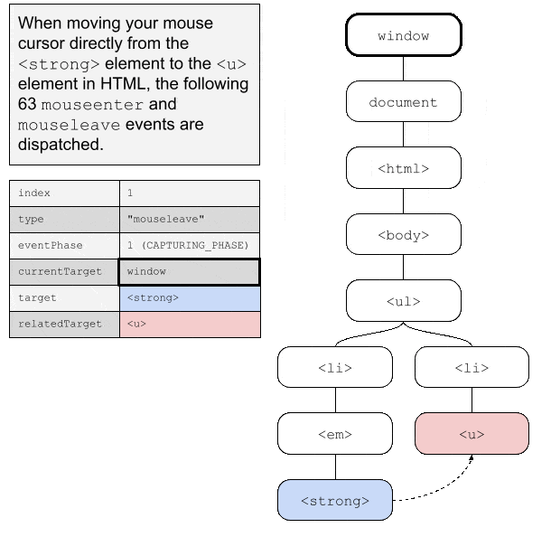
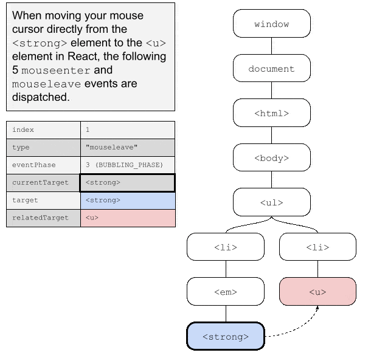
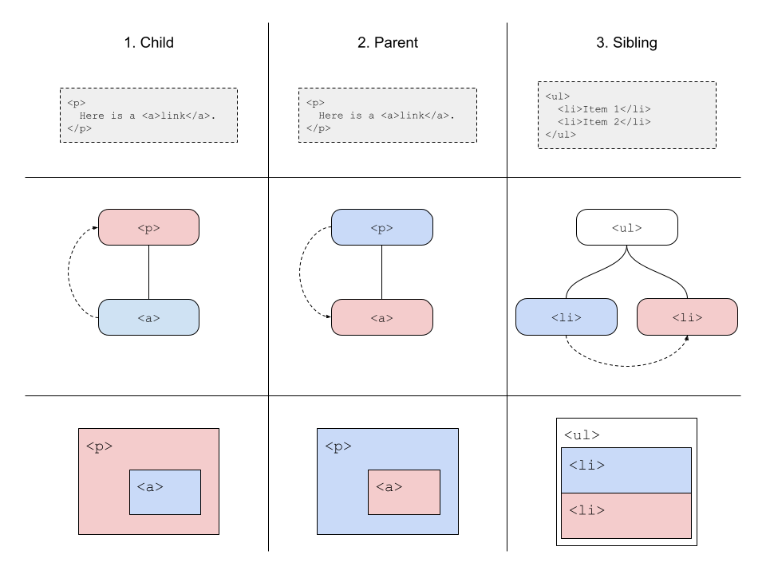
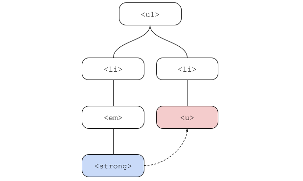
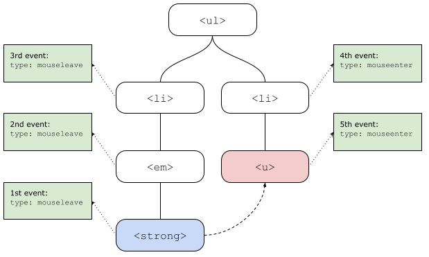
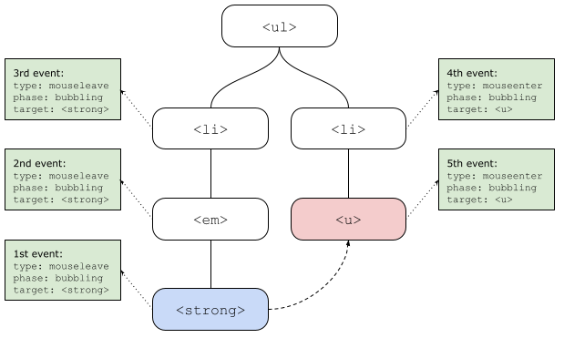

While researching a related topic, I came across this section in [the React documentation for synthetic mouse events](https://reactjs.org/docs/events.html#mouse-events):

> The `onMouseEnter` and `onMouseLeave` events propagate from the element being left to the one being entered instead of ordinary bubbling and do not have a capture phase.

So, what does that even mean? How do `mouseenter` and `mouseleave` events actually propagate in the DOM and how do they then happen in React? Which events are send and in which order? Why did React change this compared to the DOM and did they do a good job at changing this?

That's what I set out to investigate. So come along for the ride.

### TL;DR

React `mouseenter` and `mouseleave` events are weird, but more sensible than their DOM counterparts. They¨re all bubbling events though, but they don't really bubble "from" anywhere. And they even bubble the wrong way!

An even better implementation in my opinion would be to just dispatch regular non-capturing, non-bubbling events to each element in sequence. It would be exactly that same as what React does now, except all the events would be in the `AT_TARGET` phase, the target would be the element in question and the `.bubbles` property would be false.

Compare the 63 events sent in the DOM to the 5 events sent in React for the same mouse move in the same document tree:

<table>
<tr><th>Events in the DOM</th><th>Events in React</th></tr>
<tr><td>
<figure>
<a href="./dom-events-proper-optimized.gif"></a>
</figure>
</td><td>
<figure>
<a href="./react-events-optimized.gif"></a>
</figure>
</td></tr>
</table>

---

## Codepen example

Here is the small example application, that I built. It's really simple, but does all the things we want to test. For every element it listens for both `mouseenter` and `mouseleave`, both on bubbling and capturing event phases, and both using React listeners and DOM listeners.

{}

All the debugging information is output to the console, so not much to see if you just play around with the above. However, if you do open the console and move the mouse around a bit, you will quick get flooded with messages, because there really are a lot of events dispatched all over the place!

---

## What do those events even mean?

The `mouseenter` event is dispatched to a given target element, if and only if, the mouse pointer before the event was not inside the target element or any child inside the element and then enters the element or any child inside the element.

Reversibly, the `mouseleave` event is dispatch to a given target element, when the mouse pointer was within the element or any child inside the element and then moves outside of the element or any child inside the element.

Note that not all HTML elements have a visual representation, so some elements are collapsed or have no actual area to be inside. Consider for example a table, where you can have `<table><tbody><tr><td>Cell</td></tr><tbody><table>`, but the only thing you see visually in the browser is the single cell. You can move you mouse cursor from outside the table to inside the cell in one movement, and in that single instance, you will be entering 4 different elements. Conversely, you can move your cursor out of the cell to the outside leaving 4 elements in a single instance.

### Bubbling and capturing in HTML

HTML events (almost) always both bubble and capture. Mouse events in particular definitely always do. Let's ignore capturing events for now and stick to bubbling events. We do this because bubbling events are harder to distinguish from target events in that you assign the listener in the same way.
 
Let's say we have this simple bit of HTML:

```html
<main>
  <h1>Favorite dogs</h1>
  <chapter>
    <p>My favorite dog is of course <strong>the corgi</strong>.</p>
  </chapter>
</main>
````

If we assign a (non-capture) event listener to the `<chapter>` element in JavaScript and then move the mouse cursor from the `<h1>` title directly to the `<p>` element, how many times do you think the event listener will be invoked? Two! The mouse will enter <p> element, and in doing so, it will also enter the `<chapter>` element. Because the mouse enters the `<chapter>` element, the `mouseenter` event will dispatch to the chapter element. Then because the mouse entered the `<p>` element, a mouseenter event will dispatch on the `<p>` element. But because this event bubble, in dispatching this event, the DOM will also send an event to all parents of the `<p>` element in order starting from the parent first moving all the way out to the document root (and then to the `window` object).

The difference between the element being dispatched to the chapter element because the chapter element was entered, and the event dispatched to the chapter element because a child element was entered and the event bubbled can be seen in two ways. The `.target` property of the event object will in the former case refer to the chapter element, and in the latter to the child element. And the `.eventPhase` property of the event object will be 2 in the first case (`Event.AT_TARGET`) and 3 (`Event.BUBBLING_PHASE`) in the latter.

So, if you want to create a listener in HTML that will be invoked, when the mouse enters a given element, but you don't care when the mouse moves around between children inside the element, you have to add a regular event listener and then also check either the target property or the eventPhase property, to make sure you're handling the right event. You could do something like this:

```js
element.addEventListener('mouseenter', (evt) => {
  if (evt.eventPhase !== 2) return;
  // The mouse definitely just moved from outside this element to inside it
});
```

It's a bit messy, but it means that these two events behave just like any other event in the document.

### The issue at the core

The issue here is, that bubbling and _mouse entering element_ conceptually are two sides of the same coin. The `mouseenter` events means that the mouse cursor moved inside this or a child. And bubbling means that you will also receive an event when any child receives the event.

No other event works like that. When you click an element, only the element that you click will dispatch an event. Because of bubbling, this event will also bubble up to all parent elements. That's why you can add a click listener to a button element, even if it has an `<em>` element inside, and you will still only receive the event once. `mouseenter` (and `leave`) is different. The concept does both things. If click events worked in the same way, it would cause a lot of trouble too.

---

## Scenarios

Let's be a bit more methodical about this. We will consider the base components of these mouse events by considering the ways that a mouse cursor can move between different elements in the DOM. Let's divide the scenarios into three cases.

1. The mouse pointer moves from an element to a child of that same element.
2. The mouse pointer moves from an element to a parent of that same element.
3. The mouse pointer moves from an element to a sibling of that same element.

These are the three basic scenarios. All of them exist with more than one degree though, so if the pointer moves from an element to its grandparent (or great-grand), it is still case 2. If the pointer moves from an element to its cousin (or second-cousin), it is still the same concept as scenario 3. And even if it moves to a cousin once or twice removed, it's still scenario 3.

Let's illustrate these basic cases and some slightly more advanced variants.

<figure>
<a href="./mouse-event-scenarios.png"></a>
<caption><em><small>Mouse events illustrated in both HTML, DOM tree, and visual representation. The blue element is the origin and the red element is the destination.</small></em></caption>
</figure>

### From element to a child

If the mouse cursor moves from an element to a child element, a single `mouseenter` event is broadcast to the child.

Let's say we have a very simple document with just this:

```html
<body>
  <button>Hover me</button>
</body>
```

When you move the cursor from the body (anywhere outside the button) to the button, an `AT_TARGET` event will dispatch to the button with both `.target` and `.currentTarget` set to the button.

This event both captures and bubbles though, so actually all of these events will be dispatched in this order:

| No. | Element | Phase | `.target` | `.currentTarget` |
|-|-|-|-|-|
| 1 | `window` | `CAPTURING_PHASE` | `<button>` | `window` |
| 2 | `document` | `CAPTURING_PHASE` | `<button>` | `document` |
| 3 | `<html>` | `CAPTURING_PHASE` | `<button>` | `<html>` |
| 4 | `<body>` | `CAPTURING_PHASE` | `<button>` | `<body>` |
| 5 | `<button>` | `AT_TARGET` | `<button>` | `<button>` |
| 6 | `<body>` | `BUBBLING_PHASE` | `<button>` | `<body>` |
| 7 | `<html>` | `BUBBLING_PHASE` | `<button>` | `<html>` |
| 8 | `document` | `BUBBLING_PHASE` | `<button>` | `document` |
| 9 | `window` | `BUBBLING_PHASE` | `<button>` | `window` |

#### Direct to grandchild

If we move from an element directly to a grandchild, the DOM will treat that as if first the child was entered and then immediately following that, the grandchild is entered. So let's say we create this structure instead:

```html
<body>
  <ul>
    <li>Hover me</li>
  </ul>
</body>
```

Because the `<ul>` does not actually have any visual size, we can move directly from the `<body>` to the `<li>`. When that happens, the DOM will dispatch (including capturing and bubbling) a mouseenter event on the `<ul>` first, and then on the `<li>` second. That will generate all of these events in this order:

| No. | Element | Phase | `.target` | `.currentTarget` |
|-|-|-|-|-|
| 1 | `window` | `CAPTURING_PHASE` | `<ul>` | `window` |
| 2 | `document` | `CAPTURING_PHASE` | `<ul>` | `document` |
| 3 | `<html>` | `CAPTURING_PHASE` | `<ul>` | `<html>` |
| 4 | `<body>` | `CAPTURING_PHASE` | `<ul>` | `<body>` |
| 5 | `<ul>` | `AT_TARGET` | `<ul>` | `<ul>` |
| 6 | `<body>` | `BUBBLING_PHASE` | `<ul>` | `<body>` |
| 7 | `<html>` | `BUBBLING_PHASE` | `<ul>` | `<html>` |
| 8 | `document` | `BUBBLING_PHASE` | `<ul>` | `document` |
| 9 | `window` | `BUBBLING_PHASE` | `<ul>` | `window` |
| 10 | `window` | `CAPTURING_PHASE` | `<li>` | `window` |
| 11 | `document` | `CAPTURING_PHASE` | `<li>` | `document` |
| 12 | `<html>` | `CAPTURING_PHASE` | `<li>` | `<html>` |
| 13 | `<body>` | `CAPTURING_PHASE` | `<li>` | `<body>` |
| 14 | `<ul>` | `CAPTURING_PHASE` | `<li>` | `<ul>` |
| 15 | `<ul>` | `AT_TARGET` | `<li>` | `<li>` |
| 16 | `<ul>` | `BUBBLING_PHASE` | `<li>` | `<ul>` |
| 17 | `<body>` | `BUBBLING_PHASE` | `<li>` | `<body>` |
| 18 | `<html>` | `BUBBLING_PHASE` | `<li>` | `<html>` |
| 19 | `document` | `BUBBLING_PHASE` | `<li>` | `document` |
| 20 | `window` | `BUBBLING_PHASE` | `<li>` | `window` |

Wow, that's a ton of events already! But if we split it up after the 9th event, we can see that it is actually two separate sets of event dispatches starting with capturing at window, moving to the target and bubbling back up to the window for the `<ul>` first and the `<li>` second.

However, if we look at only the events dispatched to the `<ul>` element that either happen at target phase or bubbling phase (which would be events invoked by a non-capture listener), we can see there are actually two of them:

| No. | Element | Phase | `.target` | `.currentTarget` |
|-|-|-|-|-|
| 5 | `<ul>` | `AT_TARGET` | `<ul>` | `<ul>` |
| 16 | `<ul>` | `BUBBLING_PHASE` | `<li>` | `<ul>` |

Here we can clearly see the difference in both the target and phase properties though.

Imagine adding one more element to the stack - maybe an `<a>` inside the `<ul>`. If we can enter directly from the `<body>` to the `<a>` (requires some CSS, but definitely possible), we would suddenly have a total of 33 events (9 + 11 + 13). And 3 of them would be invoking a non-capture listener on the `<ul>` element.

### From element to parent

When moving from an element to a parent, the exact same thing occurs with a `mouseleave` event. If given this HTML:

```html
<body>
  <button>Move out of here</button>
</body>
```

And you move the mouse cursor from the button and out to the `<body>`, 9 `mouseleave` events will be dispatched starting with capture at the `window`, over target phase at the button and bubbling all the way back up to the `window`.

Similarly, if you move out of two elements in a single move, for instance moving from the `<li>` to the `<body>` in this HTML:

```html
<body>
  <ul>
    <li>Get out!</li>
  </ul>
</body>
```

A total of 20 events would be dispatched just like before, except with type `mouseleave`.

### From element to sibling

Things get a lot more interesting when you move from an element to another element, that is not either an ancestor or descendant or the original element. This could be when you move from an element to a sibling, a cousing, a nephew, or really any other element not in the direct chain above or below that first element.

An example would be this simple HTML:

```html
<body>
  <ul>
    <li id="1">Move from here</li>
    <li id="2">Move to here</li>
  </ul>
</body>
```

When you move from the first `<li>` to the second `<li>`, what actually happens is that the DOM will dispatch events as if you move from the first `<li>` to the `<ul>` and then from `<ul>` to the second `<li>`.

So these 22 events would be broadcast in order:

| No. | Type | Element | Phase | `.target` | `.currentTarget` |
|-|-|-|-|-|-|
| 1 | `mouseleave` | `window` | `CAPTURING_PHASE` | `<li id="1">` | `window` |
| 2 | `mouseleave` | `document` | `CAPTURING_PHASE` | `<li id="1">` | `document` |
| 3 | `mouseleave` | `<html>` | `CAPTURING_PHASE` | `<li id="1">` | `<html>` |
| 4 | `mouseleave` | `<body>` | `CAPTURING_PHASE` | `<li id="1">` | `<body>` |
| 5 | `mouseleave` | `<ul>` | `CAPTURING_PHASE` | `<li id="1">` | `<ul>` |
| 6 | `mouseleave` | `<ul>` | `AT_TARGET` | `<li id="1">` | `<li id="1">` |
| 7 | `mouseleave` | `<ul>` | `BUBBLING_PHASE` | `<li id="1">` | `<ul>` |
| 8 | `mouseleave` | `<body>` | `BUBBLING_PHASE` | `<li id="1">` | `<body>` |
| 9 | `mouseleave` | `<html>` | `BUBBLING_PHASE` | `<li id="1">` | `<html>` |
| 10 | `mouseleave` | `document` | `BUBBLING_PHASE` | `<li id="1">` | `document` |
| 11 | `mouseleave` | `window` | `BUBBLING_PHASE` | `<li id="1">` | `window` |
| 12 | `mouseenter` | `window` | `CAPTURING_PHASE` | `<li id="2">` | `window` |
| 13 | `mouseenter` | `document` | `CAPTURING_PHASE` | `<li id="2">` | `document` |
| 14 | `mouseenter` | `<html>` | `CAPTURING_PHASE` | `<li id="2">` | `<html>` |
| 15 | `mouseenter` | `<body>` | `CAPTURING_PHASE` | `<li id="2">` | `<body>` |
| 16 | `mouseenter` | `<ul>` | `CAPTURING_PHASE` | `<li id="2">` | `<ul>` |
| 17 | `mouseenter` | `<ul>` | `AT_TARGET` | `<li id="2">` | `<li id="2">` |
| 18 | `mouseenter` | `<ul>` | `BUBBLING_PHASE` | `<li id="2">` | `<ul>` |
| 19 | `mouseenter` | `<body>` | `BUBBLING_PHASE` | `<li id="2">` | `<body>` |
| 20 | `mouseenter` | `<html>` | `BUBBLING_PHASE` | `<li id="2">` | `<html>` |
| 21 | `mouseenter` | `document` | `BUBBLING_PHASE` | `<li id="2">` | `document` |
| 22 | `mouseenter` | `window` | `BUBBLING_PHASE` | `<li id="2">` | `window` |

#### Cousins and nephews

If we now make an even more complex document tree, where you can move from an element to a nephew, a cousin, or even a cousin some distance removed, things get even more complicated. Take this HTML:

```html
<body>
  <ul>
    <li id="1"><em>Move from <strong>here</strong></em></li>
    <li id="2"><u>Move to here</u></li>
  </ul>
</body>
```

If you move the cursor from the `<strong>` element directly to the `<u>` element, you will be moving in the document tree by going up three levels to the `<ul>` and then down two levels to the `<u>`. Illustrated, you are moving as follows:

<figure>
<a href="./sibling-mouse-move.png"></a>
<caption><em><small>Document tree with the origin element highlighted in blue and destination element highlighted in red.</small></em></caption>
</figure>

In order to figure out which events will be dispatched, you have to do the following:

1. Find the closest common ancestor (CCA) of both the origin and the destination element. In our case the `<ul>`.
2. Find every element from (and including) the origin element up to (but not including) the CCA. In our case that would be the `<strong>`, `<em>`, and `<li id="1">` elements.
3. Find every element from (but not including) the CCA down to (and including) the destination element. In our case that would be the `<li id="2">` and `<u>` elements.

Now, dispatch a `mouseleave` event to all the elements identified in 2. starting from the origin element. Then dispatch a `mouseenter` event on all the elements identified in 3 ending with the destination element. A total of 5 events are to be dispatched as illustrated:

<figure>
<a href="./sibling-mouse-events.png"></a>
<caption><em><small>These five events will be dispatched on with these five element targets when moving from the blue node to the red node.</small></em></caption>
</figure>

Each of these five events both capture and bubble. So in our document structure, a total of 15+13+11+11+13=63 events will be sent to various nodes. We won't list them all, because theyre pretty trivial, but here's an animation of them all:

<figure>
<a href="./dom-events-proper-optimized.gif"></a>
<caption><em><small>All 65 `mouseleave` and `mouseenter` events sent in the DOM.</small></em></caption>
</figure>

If we just look at the `<u>` element and look at all the 10(!) events sent to this single node, the following events will occur in this order:

| No. | Type | Element | Phase | `.target` | `.currentTarget` |
|-|-|-|-|-|-|
| 1 | `mouseleave` | `<ul>` | `CAPTURING_PHASE` | `<strong>` | `<ul>` |
| 2 | `mouseleave` | `<ul>` | `BUBBLING_PHASE` | `<strong>` | `<ul>` |
| 3 | `mouseleave` | `<ul>` | `CAPTURING_PHASE` | `<em>` | `<ul>` |
| 4 | `mouseleave` | `<ul>` | `BUBBLING_PHASE` | `<em>` | `<ul>` |
| 5 | `mouseleave` | `<ul>` | `CAPTURING_PHASE` | `<li id="1">` | `<ul>` |
| 6 | `mouseleave` | `<ul>` | `BUBBLING_PHASE` | `<li id="1">` | `<ul>` |
| 7 | `mouseenter` | `<ul>` | `CAPTURING_PHASE` | `<li id="2">` | `<ul>` |
| 8 | `mouseenter` | `<ul>` | `BUBBLING_PHASE` | `<li id="2">` | `<ul>` |
| 9 | `mouseenter` | `<ul>` | `CAPTURING_PHASE` | `<u>` | `<ul>` |
| 10 | `mouseenter` | `<ul>` | `BUBBLING_PHASE` | `<u>` | `<ul>` |

If you want to detect something happening on this particular element, you have to be very careful with which properties are set to what to be sure, that you actually detect the event, that you care about!

## What does React do?

All the above is what HTML, DOM, and JavaScript do. So what does React do then?

React recognized, that this mess of events is an issue. In stead of sending events to all elements in a tree, React actually only sends events directly to the targeted nodes. So if you move from an element to a child, React only sends one event, namely to the child. This event doesn't capture nor bubble. Well, kind of.

What React actually do is weirder than you would think. They kind of only send one `mouseleave` event and that events bubbles up through the left nodes (as in the nodes that the mouse is _leaving_, not nodes _to the left_). But only through the left nodes, not further above it all the way to the document root. This kind of makes sense - it is an event, that partially bubbles. There is no such thing in HTML, but React invented this, and I think it is a defensible decision.

However, React then sends a single `mouseenter` event to the destination element, that bubbles ***in reverse*** from the outermost entered element to the destination element! This makes no sense - events can never bubble down the document tree, only up! This violates everything that is known about event propagation!

And to make things even weirder, none of these events are ever in the target phase. All the events are in the bubbling phase, even the events that are actually sent to the targets.

So in our example from before were we move from the `<strong>` element directly to the `<u>` element as follows:

<figure>
<a href="./sibling-mouse-move.png"></a>
<caption><em><small>Document tree with the origin element highlighted in blue and destination element highlighted in red.</small></em></caption>
</figure>

React will dispatch these 5 events (and only these 5) in the same order as before but now this diagram includes all the bubbling as well:

<figure>
<a href="./sibling-mouse-react.png"></a>
<caption><em><small>React dispatches exactly these five events when moving from one element to another.</small></em></caption>
</figure>

Compared to the previous animation, this looks a lot simpler in React:

<figure>
<a href="./react-events-optimized.gif"></a>
<caption><em><small>React only sends 5 events for even a complex mouse move.</small></em></caption>
</figure>

In table form, React dispatches these events:

| No. | Type | Element | Phase | `.target` | `.currentTarget` |
|-|-|-|-|-|-|
| 1 | `mouseleave` | `<strong>` | `BUBBLING_PHASE` | `<strong>` | `<strong>`
| 2 | `mouseleave` | `<em>` | `BUBBLING_PHASE` | `<strong>` | `<em>`
| 3 | `mouseleave` | `<li id="1">` | `BUBBLING_PHASE` | `<strong>` | `<li id="1">`
| 4 | `mouseenter` | `<li id="2">` | `BUBBLING_PHASE` | `<u>` | `<li id="2">`
| 5 | `mouseenter` | `<u>` | `BUBBLING_PHASE` | `<u>` | `<u>`

Furthermore, React sets the `.bubbles` property on these events to true. Even though these events clearly don't standard bubbling practices.

Note in particular, how the common ancestor, the `<ul>` element, doesn't receive a single event at all. In the DOM, it would receive 10 events, but in React there is no way to tell if `mouseenter` or `mouseleave events occur within its children through the `onMouseEnter` and `onMouseLeave` properties.

### A more sensible alternative

I understand why React have decided to only send these five events. These are probably the only events that you care about and they convey the exact information that you need. But the decisions are weird.

I would change just one thing. I would dispatch all 5 events as regular non-bubbling events directly to the five elements. This would make the following four principles true about these two events, as they are for *all other events* in both React and DOM:

1. When an element has identical `.target` and `.currentTarget` attributes, it is in the `AT_TARGET` phase.
2. If an event bubbles, it bubbles all the way to the document root.
3. Events only ever bubble **up** the document tree, never down.
4. Every event captures.

It would cause more events to be dispatched, in particular a bunch of capture events would be sent all the way up the document tree. But capture listeners are special, so if you are using them, you are probably already examining the properties carefully.

You might be thinking, that with the React way of doing it, you can see which elements was the source of the leave event through the `.target` property, which you cannot in my suggestion. I will admit, that this is a loss of functionality.

One might think, that we can use the `.relatedTarget` property, that already exists on mouse events, for that purpose, but it is already used for a different purpose. On the `mouseleave` events, the `.relatedTarget` property points to the destination node. And on the `mouseenter` events, it points to the origin node.

We could however invent a new property just for this purpose. We could call it `.originTarget` or something like that. It would only exist for these two events.

Other than that, my suggestion would work exactly the same as now, if you just place regular `onMouseEnter` and `onMouseLeave` listeners and don't look too carefully at the properties. And if you do look at the properties, you would only have to adjust your code slightly, if at all. It would also enable you to use `onMouseEnterCapture` and `onMouseLeaveCapture` listeners.

## In summary

All in all, `mouseenter` and `mouseleave` events are a lot simpler in React than in the DOM, but they are still weird. Even weirder than they need to be. Choices have been made to simplify them as compared to the mess of events send in the DOM, but not all of those choices make a ton of sense. This could definitely be improved so as to not violate a ton of (well, 4) regular event propagation principles.