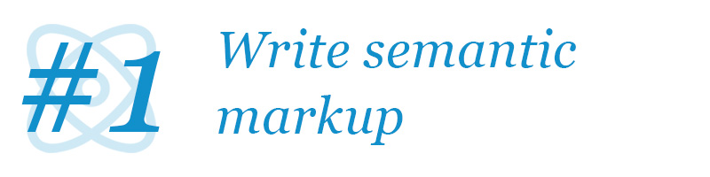
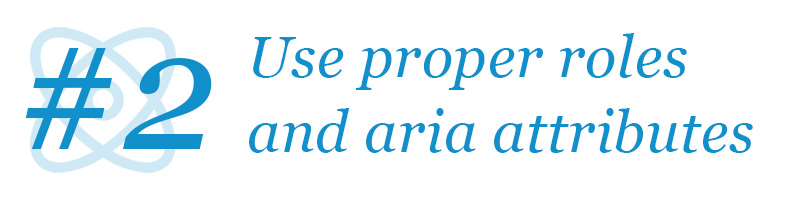
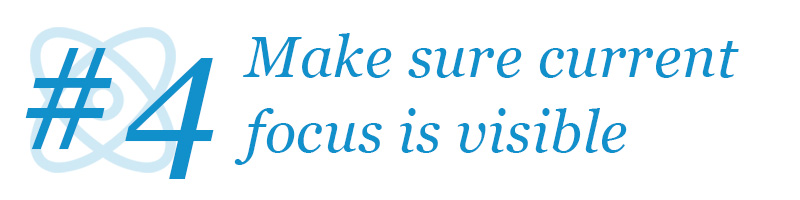
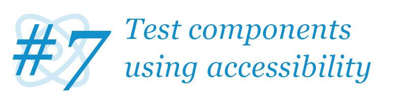
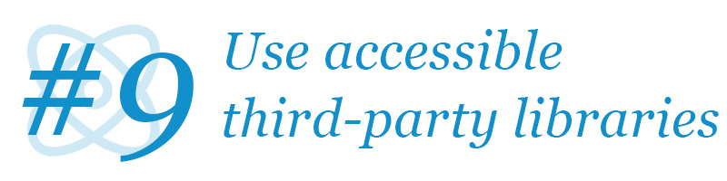

Web accessibility is somehow both the common fork and the holy grail of web development today – even in popular web frameworks such as React.

Web accessibility is so ingrained in how the web works that it's impossible to do without, yet at the same time, it is a concept so clouded in mystery and lore, that it scares most developers and content creators before even attempting to address it.

In this article we'll start out exploring [the importance of web accessibility](#why-is-web-accessibility-important), go on to the main principles of [how to make web content accessible](#making-your-website-accessible), then we'll cover our [9 primary tips for creating accessible React components](#tips-for-accessible-react-components), and finally distill this into [a short checklist of 9 points](#react-web-accessibility-checklist), that you should keep in mind when writing React components - if you do, you'll be home safe!

Before going too deep into this, please know that even though this article specifically addresses how to make _React_ components and applications accessible, 95% of the content presented here is relevant for any web framework.

---

## Why is web accessibility important?

This question is probably one of the most answered questions as it's included in any tool, service, or guide to accessibility. Yet, I feel a need to address this too, if for nothing else my own catharsis on the subject.

Web accessibility is first and foremost _not only_ but _also_ about disabled people. You might think, that your website about comic books isn't relevant to blind users, thus you have no need for any accessibility, but that's completely missing the point. Yes, blind people also benefit from accessible websites, but so do many, many other users of web content.

I personally like summarizing web accessibility (a bit coldly) as follows:

> Web accessibility is accomodating anyone using your website regardless of input or output hardware.

This might seem overly simplified, yet it encompasses most use-cases for accessible considerations.

Consider people with mobility limitations (which include a lot of people from paralyzed users over people with Parkinson's to someone with a broken arm) - they'll all use some other form of input device than a regular mouse in order to interact with the web site.

Or consider people with vision impairment (which include a lot of people from blind users to older people with reduced eyesight to someone sitting in bright sunlight or using a tiny/huge screen) — they'll all have different output requirements than the "average" user and maybe even use alternative output devices such as screen readers or braille displays.

At its core, web accessibility is about making sure that people can access your content regardless of hardware - and why would you limit what hardware people should be using anyway?

---

## Making your website accessible

The following two documents outline web accessibility with all the relevant properties, that a correctly accessible web document should adhere to:

1. WCAG: The [Web Content Accessibility Guidelines](https://www.w3.org/WAI/intro/wcag) provides general guidelines for accessible web content not specifically targeted for web applications, but plain old web documents and simple interactive web sites (nothing more complex than a form).

2. WAI-ARIA: The [Web Accessibility Initiative — Accessible Rich Internet Applications](https://www.w3.org/WAI/intro/aria) document addresses complex web applications and provides techniques and best-practices for making intricate web components usable by all users regardless of input and output devices.

Where many articles about web accessibility address the former specification, the latter is much more important for most React applications, as they more often fall into the category of _rich internet applications_ - a slightly antiquated term for modern single-page web applications.

### WCAG

The WCAG guideline summarizes web accessibility in the following 4 categories:

1. **Perceivable**: _All information must be presentable to users in a way they can perceive_.
2. **Operable**: _All user interface components and navigation must be operable_.
3. **Understandable**: _Information and the operation of the user interface must be understandable_.
4. **Robust**: _Content must be robust enough that it can be interpreted by a wide variety of user agents, including assistive technologies_.

### WAI-ARIA

WAI-ARIA addresses primarily more complex web controls and interfaces, that are used in modern web sites – often known from old-fashioned desktop applications. The specification contains fundamental properties (mostly prefixed as `aria-*`) that can be applied to a whole range of elements in HTML denoting their relationships and states – and includes principles and techniques on how to implement proper:

* Content structures such as dialogs, alerts, tabs, and accordions.
* Complex form elements such as sliders, listboxes, and combo boxes.
* Application elements such as toolbars, menus, and tooltips.

For all of these (and many more - 27 widgets in total are described), a number of expectations are listed including how to navigate a component using a keyboard and how focus is expected to behave, how to make sure screen readers know how to inform a user of the functionality and state of a widget, and comes with at least one example for every widget.

---

## Tips for accessible React components

While every React developer ought to follow all the principles listed in the above guidelines – both those on web content in general and rich internet applications in particular – some principles are more pervasive to the user experience than others. Also, there's some extra tips and tricks you can do in your frontend development setup, that'll increase the likelihood your app is behaving accessibly.




### 1: Write semantic markup

Semantic markup is the discipline of wrapping your text and interactive elements in the web document in the proper tag and with the proper attributes, for which it is meant.

An HTML snippet such as `<span>Review</span>` carries no semantic meaning. Is it a verb or a noun? Can you interact with it?

It can however be styled to look and act like anything from a headline to a button - for users viewing the page through a normal browser that is.

If it were either of those, it should have been tagged as `<h2>Review</h2>` or `<button>Review</button>` respectively (the actual level of header to be determined by context). In this fashion, the browser, and everything else, would know the text to have a certain semantic meaning.

Semantic markup is first and foremost about using the right HTML tag for every bit of content, but also about assigning the right attributes to the elements in question - an `<input type="range" />` is very different from an `<input type="checkbox" />`.

#### Why should you write semantic markup?

Semantic markup is the web development equivalent of using full sentences rather than just a string of words with no direct coherence or relation between them. Without proper semantic markup, the data presented in a web document is just a bunch of unrelated items with no context, meaning, or relationship – except the visual relationships displayed in a browser. Quite a lot of computer systems rely on semantic markup, not restricted to:

* Search engines
* Social networks
* Sharing services (basically, anywhere you can share a web link, from text messages to slack).
* Indexing services
* Smart devices (Alexa and Siri can only answer your question if the website with the answer is properly formatted)
* Browsers (duh!)
* Screen readers

And many, many others.

#### Why semantic markup is important for accessibility

Let's say your website has a left-side menu located on every page. Without the menu being marked up as such, a screen reader would "correctly" read all the menu items every time the page changed, because it is the first thing in the document.

With proper semantic markup, a document author can instruct screen readers to skip to the main content and ignore navigational elements (unless the viewer actually wants to know about them).

Similarly, screen readers can inform users of collapsible elements, the relationship of list items and data cells, the relationship between labels and form fields, etc.

Without proper semantic markup, the screen reader will simply read every bit of text on the page with no context or relation. With semantic markup, a screen reader can read only the text on the page, that matters to the user at the current time - and put it in context.




### 2: Use proper roles and relevant `aria-*` attributes

Semantic markup will only get us so far. Yes, we can create a comprehensive document outline for an interlinked article with simple elements, but web applications often have much more complex components such as tabbed interfaces, menus, dialogs, and many other elements.

Browsers can understand those too, but not with basic semantic markup only. For these to be fully supported, often the document author would need to augment the semantic markup with roles and `aria-*` attributes.

#### Which elements require a role or attribute and when?

Any of [these](https://developer.mozilla.org/en-US/docs/Web/Accessibility/ARIA/ARIA_Techniques). This unfortunately cannot really be summed up. Check the list whenever you're developing some more complex widget, composition, structure, or landmark and see if any of them fit.

Another approach is to look at the [27 pre-made W3-sanctioned examples of interactive widgets and elements](https://www.w3.org/TR/wai-aria-practices-1.1/#aria_ex) and see if you're trying to implement any of those. They all come with full interactive examples illustrating both HTML structure and JS implementation for expected behavior. However, WAI-ARIA is not limited to these examples and often you'll have some component that isn't exactly one of these 27 but a variant of one of them or even a mix of multiple examples. In that case, follow the documentation on the raw roles and attributes and test everything with a real screen reader!

However, also know when **not** to apply a role! Understand implicit roles and legal roles - you shouldn't do `<button role="button" />` as [this role is (of course) implicit](https://developer.mozilla.org/en-US/docs/Web/HTML/Element/button), and you also shouldn't ever do `<h1 role="button" />` as [a heading should never be a button](https://developer.mozilla.org/en-US/docs/Web/HTML/Element/Heading_Elements).

#### Why roles and `aria-*` attributes are important for accessibility

This kind of answers itself. WAI-ARIA is the definition after which all screen readers are modeled, so they'll assist users based on the recommendations here. They expect web pages to behave according to WAI-ARIA and if so, will assist the user in their work. If not, they cannot really help the user.

WAI-ARIA is _the_ definition of complex interactive web applications. Not following it is a sure way to **not** be accessible. Following it is the only true way to **be** accessible.


### 3: Consider the accessible name of every element

When you see a button on a webpage, you probably know what it does. If you don't, the page is poorly made. But just because you do, when you see it, doesn't mean a non-visual user does when interacting with it.

Maybe the button has a text label - okay then a screen reader can easily read the name of the button. But the button text might only make sense in the context of the element it is next to - e.g. it might say `"Select this"` where _"this"_ makes perfect sense when viewed, but not when read aloud.

The button might also have an image, an SVG-shape, or even some weird font glyph as it's a visual element - something that'll make sense to you as a sighted user, but not to a user with a screen reader.

And all of the above applies not only to buttons but also to input fields, headlines, images, videos, and many other important smaller elements of your web application.

In all such cases, you should make sure to provide a textual meaningful accessible name to the element in question.

#### What is the accessible name?

The accessible name is the text string used by browsers and screen readers to represent the element in question. The algorithm for resolving the accessible name of an element is quite complex to account for some rather esoteric situations but is mostly pretty simple when used.

For an in-depth understanding of how to set the accessible name of a component, please see the related post on [15 (Mostly Bad) Ways to Set The Accessible Name]


#### Why the accessible name is important for accessibility

To reiterate: The accessible name of any element will determine how the element is announced to any vision-impaired user. Not properly setting the accessible name for even semi-complex components will confuse these users at best – and completely hinder them in using your application at worst.




### 4: Make sure current focus is clearly visible

For people using a keyboard, the focus border/outline around elements is very important. The focus outline is natively shown in browsers as a blue glow - for instance as this around a button, input, and link in Chrome and Firefox respectively in this [codepen](https://codepen.io/barklund/pen/GRZbJgd):

{}

And this styling is exactly what this is about

#### When should you show focus?

You must show current focus visually on-screen whenever a user navigates to an element using a keyboard. But sometimes also when a user navigates to an element using a mouse or other pointer device. However, it is less urgent in the case of a mouse or a pointer device, as any such user will already have a pretty good idea where the device was when clicking, so they'll most likely assume that focus is also there.

For keyboard navigation showing focus is of the utmost importance. It must never **not** happen. And if you forget proper focus display for even a single element, you can completely throw off the user as they're navigating around.

#### Why would I not show it?

If you only use default HTML elements and don't tinker too much with their styling, you get focus styling for free. Buttons, links, and inputs already have excellent focus styling and appear as users expect.

The reason for even bringing this item up here is for the following concerns:

1. Sometimes you want users to be able to focus non-standard elements in order to interact with non-standard widgets
1. Sometimes designers want to have the default styling removed, as it can be a bit of an eyesore when clicking buttons in a nice application

The proper ways to handle these two concerns are slightly different.

##### Focus styling for custom focusable elements

If you make custom focusable elements, make sure they also have focus styling. For instance, say you make a collapsible header as this:

```html
<header class="collapsible-header" onClick="collapseHeader();" tabindex="0">
  <h1>I can be collapsed?</h1>
</header>
```

In such a case, make sure to also include focus styling for your header:

```css
.collapsible-header:focus {
  outline: 2px solid lightblue;
}
```

This is obviously not the best semantic HTML for such a construction, but you might find yourself building something similar when creating a complex widget. This example in particular could probably have used a `role="button"` and at least an `aria-expanded` property (as detailed by [the _"Disclosure"_ pattern in WAI-ARIA](https://www.w3.org/TR/wai-aria-practices-1.1/#disclosure)).

##### Hiding click focus styling

If you want to hide focus when clicking buttons (and there's a couple of reasons for wanting to do that), you must make sure to only do so when users are interacting with a mouse or pointer device, and **not** when users are using a keyboard - and actually rely on this visual feedback to be able to interact with the page.

One such method is using [the `:focus-visible` selector](https://developer.mozilla.org/en-US/docs/Web/CSS/:focus-visible) rather than just `:focus`. However, browser adoption is not that impressive on this one (most notably with Safari not supporting it), so it probably won't be good enough.

Another method is to use JavaScript to detect whether the user is navigating with a keyboard (mostly just detecting the tab key, but also arrow keys) and showing or hiding focus styling based on that. A library such as [`@moxy/react-keyboard-only-outlines`](https://github.com/moxystudio/react-keyboard-only-outlines) can help with that (in React specifically).

And as always, there's much more than three ways to skin a cat (and browsers are weird). [This great article by Roman Komarov](https://www.kizu.ru/keyboard-only-focus/), however, dated a couple of years, gives a great overview of the problem, limitations, and opportunities of the different solutions (using CSS only).

#### Why showing focus is important for accessibility

Not all users can and will use a mouse or other pointer device. There's a number of reasons not to use a mouse, including joint or tendon problems (e.g. _"mouse arm/elbow"_), convenience or preference, reduced motor skills, or even missing limbs. And probably a bunch more that neither you nor I fully _can_ or even _need to_ know.

Just rest assured, that some portion of your visitors will not be using a mouse or pointer device to interact with parts or all of your website. They will be using a keyboard for navigation at some point. And you should make sure to support that.

Try using a keyboard only when navigating on any slightly complex web page, and you'll soon be searching frantically for this very important focus outline on elements. You _need_ this visual feedback to have an idea, where you're currently interacting with the webpage. Focusing an element is the only way to interact with it - be it clicking a button, navigating to a link, or inputting data. So knowing where focus is, is of vital importance to do anything on a webpage.


### 5: Respect focus expectations

This point is related to but very importantly different from the above about displaying focus. This is about keyboard users' expectations of how focus moves around on a page. As discussed, users can use the tab key to move focus from one element to the next, but that can't and won't be a fix-all solution. There's a number of issues with expecting that to be the only way to move focus on a page.

#### When is regular focus management not enough?

This is a non-exhaustive list of situations, where simple tab order is not good enough:

* If you have a list of interactive elements and it will auto-load more elements once you reach the end, users can never tab to interactive elements later on the page if tabbing is the only model.
* If you have a grid of interactive elements, tabbing from elements before the grid to after the grid will require a huge amount of keyboard presses - for a 10x10 grid, that's 100 keypresses, which is definitely too much to expect.
* Form inputs are often expected to be navigable by arrow keys to some extent - for instance between radio buttons or options in a listbox. If you implement custom versions of these, make sure to follow these expectations.
* If you open a popup or expand a section of content, you expect focus to move to the newly added content. And when closing something, focus should move sensibly out of the removed content as well.

#### How to handle special focus expectations

There's a number of ways to handle focus expectations. However, you don't have to invent your own methods. Most of the time you should follow the WAI-ARIA specification, which for all the widgets listed also includes a full write-up on focus expectations - namely what tab and shift-tab do, how and when keyboard arrows can be used, etc.

For the above-listed examples, you can look up the WAI-ARIA specification for the following patterns:

* [_"Feed"_](https://www.w3.org/TR/wai-aria-practices-1.1/#feed) describes auto-loading pagination
* [_"Grid"_](https://www.w3.org/TR/wai-aria-practices-1.1/#grid)  describes a grid of interactive elements 
* [_"Listbox"_](https://www.w3.org/TR/wai-aria-practices-1.1/#Listbox) describes dropdown-like lists of options 
* [_"Radio group"_](https://www.w3.org/TR/wai-aria-practices-1.1/#radiobutton) describes groups of radio buttons 
* [_"Dialog"_](https://www.w3.org/TR/wai-aria-practices-1.1/#dialog_modal) describes popups/dialogs
* [_"Accordion"_](https://www.w3.org/TR/wai-aria-practices-1.1/#accordion) describes collapsible/expandable content

Sometimes you'll come across some very domain-specific widgets, that don't really conform to any of these standard widgets. In such a case it can help to find one or more standard widgets that _"feel similar"_ to what you're building – and try to obey the spirit of these concepts rather than their literal specifications.

Let's say that you're building a listbox in two vertical columns – the designer thinks it looks better in two columns rather than the standard single-column layout, so the list doesn't become too long. Then it would make sense to make sure, that pressing left-right arrows move between the columns while up-down moves along the columns. This would make it a combination of the keyboard expectations of a grid and a listbox, but the result would feel almost native to any user.

#### Why focus management is important for accessibility

If things don't behave as users expect, users might try for a bit, but after a while, they **will** leave and ignore your web application. This goes for everything - if something looks like a button, but don't do anything when pressed, you break expectations. And if users can't use arrow keys to navigate in a monthly calendar view, you break expectations.

Focus expectations are particularly complex, so if you implement custom widgets, pay very special attention to keyboard interaction expectations that your users will come primed with.


### 6: Pay special attention to forms

Form inputs are the bread and butter of most interactive web applications. It's a collection of very basic building blocks that can assemble into complex monsters of interactivity. If you have a form or form-like interaction in your web application, pay extra attention to the accessibility concerns that are connected with these.

#### Why are form inputs particularly complex?

There are a few concerns, that are particularly pertinent for accessibility:

* Make sure to correctly label all inputs
* Make sure tab order and focus is properly implemented
* Think in particular about mobile users and their input methods

##### Label

Make sure your inputs are labeled - and make sure this labeling is expressed so automated systems are aware of this relationship too.

This, for example, might be sufficient a visual user, but not for a screen reader:

```html
<span>Name:</span>
<input />
```

There are several ways to link a visual label to an input element:

* `<label for>` with reference to input id
* `<label>` around both text and input
* `aria-labelledby` with reference to label id
* `aria-label` if no textual label exists

And remember, [`placeholder` is not a good way](https://www.w3.org/WAI/GL/low-vision-a11y-tf/wiki/Placeholder_Research#:~:text=Placeholders%20are%20not%20Substitutes%20for%20Labels,-Placeholders%20are%20not&text=Labels%20are%20captions%20which%20inform,to%20aid%20in%20form%20completion.) to label your inputs!

##### Tab order and focus

We've previously covered the importance of [focus management](#5-respect-focus-expectations) and [focus styling](#4-make-sure-current-focus-is-clearly-visible).

Tab order is another aspect of focus management, where you'll most of the time get by using default browser order simply based on document order, but for very special cases you might want to [adjust the tab order](https://www.w3.org/TR/WCAG20-TECHS/H4.html) manually.

Often it is however recommended to move your elements in the document order and place them using CSS rather than reordering them using the `taborder` property.

If you for instance have a grid of inputs and you want the user to go through the left column top-to-bottom first, then the right column (rather than row by row), you can markup your form elements in columns instead of using a regular table.

##### Mobile inputs

Mobile and pointer device users should be paid particular attention due to the limited space on their screens. Make sure that inputs and the content they manipulate are close together so that a user with an on-screen keyboard on a small device can see both things at the same time.

Also make sure to use the correct type for your inputs, to make the mobile keyboard display the proper subset of keys. It's a lot easier to type numbers for an `<input type="number" />` than a regular `<input type="text" />`, as the latter often requires switching the keyboard to symbol/number view.

#### Why form handling is important for accessibility

With form inputs being the basic components of web application interactivity, they create the backbone of your users' interactions with your service. Getting these right is extremely important, as the expectations of proper behavior are well-known and deviations will lead to sharp user dropoff.



### 7: Test your components using accessibility queries

Now we get to tooling and setup. This tip is not about writing code in particular, but about testing it in a way, that increases the awareness of accessibility.

You should be testing your components in an automated way. That's a long-established practice, and such a statement can't be controversial anymore. However, you can test your components in many different ways and if you're not careful, you might be testing your components in ways, that real users would not interact with your application, and thus your tests are close to worthless.

#### How and why should you test your components as your users do?

> Spoiler warning: This is going to sound like an ad for [`@testing-library`](https://testing-library.com/). It's not meant to be, but I just tend to agree with their motivation.

Let's say for example, that you have a component with a button, that can open a menu - and the output looks like this when the component is closed and open respectively:

```html
<!-- Closed menu: -->
<button class="menu-button">Toggle menu</button>

<!-- Open menu: -->
<button class="menu-button menu-button--expanded">Toggle menu</button>
<aside>
  <h1>Document menu</h1>
  ...
</aside>
```

Now you have to write a test, validating, that

1. when the menu is closed,
2. you can click the button,
3. and the menu appears.

There are of course many ways to do this, but one naïve way would be to do something like this:

1. _To validate that the menu is closed:_
   1. Find an element with the class `.menu-button`
   1. Check that it does not have the class `.menu-button--expanded`
   1. Check that there is no `<aside>` element in the document
2. _To click the button_
   1. Find an element with the class `.menu-button`
   1. Send a click event
3. _To validate that the menu appears_
   1. Find an element with the class `.menu-button`
   1. Check that it **does** have the class `.menu-button--expanded`
   1. Check that there is an `<aside>` element in the document
   1. Check the `<aside>` element has an `<h1>` with the text `"Document menu"`

While this is technically a good and exhaustive test for this functionality, it is very fragile. What if the class names for the menu-button change? What if the `<aside>` is changed to another type of element? What if the `<h1>` is changed to an `<h2>`?

All these things would only change some underlying technical details that would never actually impact users in the real world, but would all make this test fail.

And some very important changes would **not** make your test fail. What if we deleted all the text inside the button or changed it to something completely different? Users would be very confused if the button said `"Free cat videos"`, but your test would still pass!

Your test should only fail when the important (user-facing) functionality of your component changes requiring you to update your tests.

So, what is a better way to test this component?

First of all, let's make some slight changes to this component.

1. Let's keep the menu in the document all the time and just hide it when inactive
2. Let's keep the state of the "toggledness" of the button directly on the button
3. Let's associate the button with the element, that it toggles
4. Let's associate the menu element with its title

These four things result in this structure:

```html
<!-- Closed menu: -->
<button
  class="menu-button"
  aria-expanded="false"
  aria-controls="menu"
>Toggle menu</button>
<aside
  hidden
  id="menu"
  aria-labelledby="menu-title"
>
  <h1
    id="menu-title"
  >Document menu</h1>
  ...
</aside>

<!-- Open menu: -->
<button
  class="menu-button menu-button--expanded"
  aria-expanded="true"
  aria-controls="menu"
>Toggle menu</button>
<aside
  id="menu"
  aria-labelledby="menu-title"
>
  <h1
    id="menu-title"
  >Document menu</h1>
  ...
</aside>
```

This does make our HTML a bit longer, but it adds some very important links between elements. They're not directly visible to users, but browsers and screen-readers will see them and assist users in interacting with the elements.

We can now make our test much simpler:

1. _To validate that the menu is closed:_
   1. Find a button with the label `"Toggle menu"`
   1. Verify that it is not expanded
   1. Find a complementary element with the label `"Document menu"`
   1. Verify that it is hidden
2. _To click the button_
   1. Find a button with the label `"Toggle menu"`
   1. Send a click event
3. _To validate that the menu appears_
   1. Find a button with the label `"Toggle menu"`
   1. Verify that it **is** expanded
   1. Find a complementary element with the label `"Document menu"`
   1. Verify that it is **not** hidden

This might read similarly to before, but the resulting stability of the test is much better. We do not depend on irrelevant technical details such as class names or HTML tag names but check for element roles and labels.

You might think, that the test for _"a button"_ above is a test for a specific HTML element, but it doesn't have to be. All these are buttons in the eyes of a browser: `<button />`, `<input type="button" />`, and `<span role="button" />`.

Putting this all together, and using the awesome selectors that can be found in `@testing-library`, this test can be written as:

```js
const menuButton = getByRole('button', {name: 'Toggle menu'});
let menu = queryByRole('complementary', {name: 'Document menu'});

// Verify that the menu is initially closed
expect(menuButton).toHaveAttribute('aria-expanded', 'false');
expect(menu).not.toBeDefined(); // It doesn't "exist" yet

// Click the button
fireEvent.click(menuButton);

// Verify that the menu is open
expect(menuButton).toHaveAttribute('aria-expanded', 'true');
menu = queryByRole('complementary', {name: 'Document menu'});
expect(menu).toBeDefined(); // It "exists" now
expect(menu).not.toHaveAttribute('hidden');
```

In practice, you'd want to do more than this (maybe `role="menu"` would be a better choice) and the real world is always more complex than a simple example as this. Nevertheless, these would be the exercises you would go through, as you turn your testing process away from technical details and over to accessibility queries.

You can play around with the `@testing-library` selectors for this example in the [testing playground](https://testing-playground.com/) ([deep link with this HTML preloaded](https://testing-playground.com/gist/44c74b5d638d4c080feab20b918654c9/a139eaa829a084229cef013a1fa9a7a0978e7778))

#### Why testing is important for accessibility

This is in essence an example of [_"eating your own dog food"_](https://en.wikipedia.org/wiki/Eating_your_own_dog_food). By testing your components as if you were a real user (potentially even using a screen-reader), you will stumble over the same problems as a (screen-reader) user does. And then in making your tests pass, you will solve the actual real-world problems, that your users would be facing while interacting with your website.

At the same time, by not relying on irrelevant technical details of your components, you make your tests less fragile to slight changes in design or structure. It's basically a **win-win**!


### 8: Add static HTML validation to your testing pipeline

Besides of course testing directly for accessibility (_"does this image have an `alt` attribute?"_) as well as testing using accessibility (_"click the button labeled `add to cart`"_), the final trick in your accessibility testing toolbox should be to statically validate, that at any point in time your HTML is fully valid.

#### Why should you use static HTML validation?

When you begin to implement the more complex widgets in the ARIA specification, for instance, accordions or tab panels, you will often refer to other elements by ID. This is the case for common properties like `aria-labelledby` or even the simple `<label for>`, but also for more specific properties such as `aria-controls` and `aria-owns`.

However, it might easily be the case, that for some configuration, that you didn't think of, you might have a temporary state, where one of these elements points to a non-existing element - simply because the element is not currently displayed. Or there might be two of them at some point - which is also an error, as ID's have to be unique.

Doing static validation of larger portions of your application in action, even while testing features completed unrelated to accessibility, you can catch these errors before they crop up in production.

And the cool thing about some of the available accessibility test tools, for instance, the [AXE test suite](https://www.deque.com/axe/), is, that you don't have to specify **what** you want to test for, as AXE knows all the HTML + ARIA rules - so it'll test for everything at once. It'll validate that all your buttons have a valid accessible name, all your inputs have labels, all your ID references exist and are unique, etc.

You can see a list of other alternative providers of automated accessibility testing tools over [on W3's website](https://www.w3.org/WAI/ER/tools/).

#### Why static HTML validation is important for accessibility

This is a great _last-line-of-defense_ style utility to catch those silly mistakes, that tend to crop up in real-world situations.


You might have a generic panel component, that always has a title, so the panel generates an ID and the panel `<section>` is `aria-labelledby` it's `<h1>` identified by said ID. However, two months down the line someone adds a panel without a title, and suddenly you have a `<section aria-labelledby>` a non-existing ID. Your normal unit and integration tests won't catch this, but a full sweep of the entire HTML of your application in all states will.

(this _totally_ made-up example did [_totally_ not happen to me](https://github.com/google/web-stories-wp/commit/0e097717b3ca1b720bd2b04b677d7e0f2c574841#diff-653ae7278fae3d73d9b3b92a11770d46L130) and was caught by this exact method of static validation)

With this last tool in effect validating your generated output at any configuration for your real-world application, you can rest assured, that all your accessibility effort is at least valid.




### 9: Make sure to use accessible third-party components and libraries

Unfortunately close doesn't count in accessibility. If you do your best to make your application accessible, but happen to use a third-party component, that has horrible accessibility, it will reflect badly upon you and your application - and your users will suffer for it.

Also, you should never assume that a third-party library is accessible - even if it's very popular and has been around for a long time. Accessibility is hard and not something you can spray on top of an existing library. It has to be baked into the core and must be a priority of the developers behind the module. If just an afterthought, it's probably not going to be adequate.

#### Which libraries are known to be accessible?

Nice try, but I, unfortunately, cannot keep such a list, nor would it even be possible. I can however make some pointed recommendations for specific areas of functionality, but for everything else you have to search for yourself.

* Drag-and-drop (Trello Card style): [`atlassian/react-beautiful-dnd`](https://github.com/atlassian/react-beautiful-dnd). See [their nice demo page](https://react-beautiful-dnd.netlify.app/iframe.html?id=board--simple) - use tab to navigate to an element, spacebar to "pick" it up or drop it, and arrow keys to move it around.

And that's it. That's the full list of React components that I've found to have decent accessibility.

I did try a lot of the plugins listed on [@brillout's list of awesome React components](https://github.com/brillout/awesome-react-components), but most of them failed either completely or just partially. Accessibility is unfortunately not high on the list of priorities for most developers – even when writing generalized reusable components.

The two _dead giveaways_ of a library correctly considering accessibility are **keyboard interactivity** and **accessible names**:

1. Try using a keyboard to interact with the plugin's demo page. Can you interact with all the controls? Does focus display and move logically around when tabbing and/or using arrow keys?
2. Check elements on the demo page in your browser developer console for roles and accessible names. Do all interactive elements have a relevant role and a dedicated accessible name? Are the accessible names customizable (e.g. for localization)?

These two checks are of course not a full guarantee, but it's a great start. If you want to dig further, you can check the WAI-ARIA list of patterns and find which ones apply to the component in question, and investigate whether the pattern is correctly followed regarding roles, properties, and keyboard interaction.

#### Why safe libraries are required for accessibility

Your users will judge you based on the weakest link in your application. If 90% is accessible, your users will still be unable to use your platform, when they encounter any of the remaining 10%.

But at the same time, you should never invent all the wheels yourself - there's a huge community of developers, that will have experienced the same pain points that you are, and you should be able to build upon their work. However, be diligent and check their stuff.

If you come across a plugin that you really like, but notice that it comes up just shy of fully accessible, feel more than free to contribute to it. You'll be helping not only yourself but also all the other projects built on that plugin and all their users in turn.

---

## React web accessibility checklist

Feel free to copy-paste this checklist or share it, but do keep [the content license](/license) in mind.

1. <span style="color:#157A15">✔</span> **Write semantic and valid markup**
1. <span style="color:#157A15">✔</span> **Use proper roles and relevant `aria-*` attributes**
1. <span style="color:#157A15">✔</span> **Consider the accessible name of every element**
1. <span style="color:#157A15">✔</span> **Make sure current focus is clearly visible**
1. <span style="color:#157A15">✔</span> **Respect focus expectations**
1. <span style="color:#157A15">✔</span> **Pay special attention to form elements**
1. <span style="color:#157A15">✔</span> **Test your components using accessibility queries**
1. <span style="color:#157A15">✔</span> **Add static HTML validation to your testing pipeline**
1. <span style="color:#157A15">✔</span> **Make sure to use accessible third party components and libraries**

So get out there and make awesome accessible web applications!